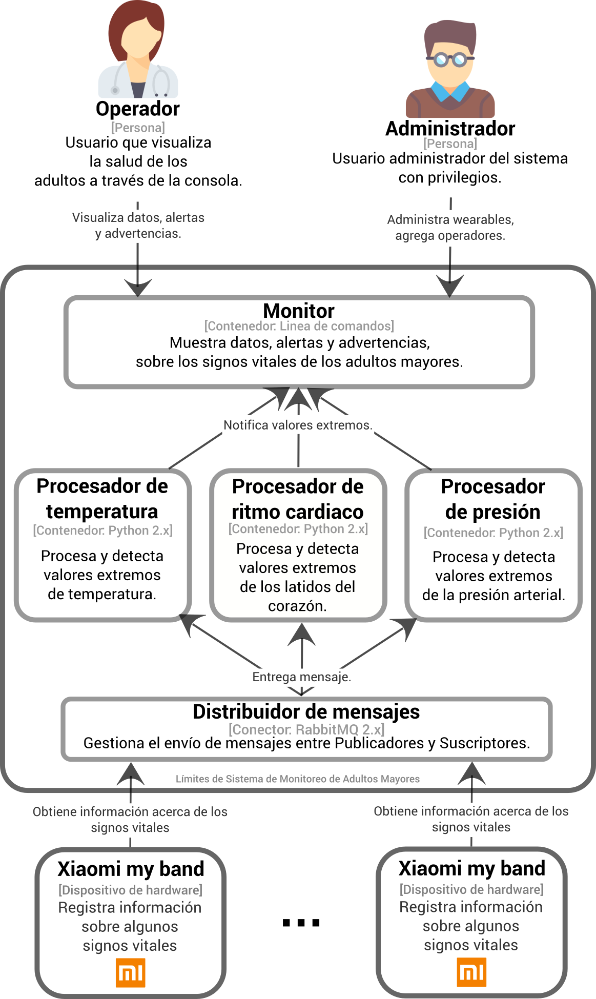

# Arquitecturas Publica-Suscribe

## Sistema de Monitoreo de Adultos Mayores (SMAM)

Existe un asilo llamado Divina Providencia en el que viven un grupo de adultos mayores, parte del personal que trabaja en el asilo, entre otras tareas, se dedica a atender las necesidades de los adultos mayores y a monitorear su estado de salud.

La fundación Catalina Huffmann, que es una fundación altruista en la región, decidió, a manera de donación, desarrollarle al asilo un sistema de cómputo para realizar las actividades de monitoreo del estado de salud de los adultos mayores de forma (semi-)automática. Para ello, la fundación utilizó un conjunto de dispositivos “wearables” que portan cada uno de los adultos mayores. Mediante el envío de información sobre ritmo cardiaco, presión arterial y temperatura, estos dispositivos “wearables” permiten monitorear en tiempo real a cada uno de los adultos mayores y de esta forma ser más eficientes en la prevención de incidencias.

En la siguiente figura se muestra el diseño de la propuesta de solución del departamento de desarrollo para el SMAM.



## Prerrequisitos
- Clonar el repositorio:
   ```shell
   $ https://gitlab.com/tareas-arquitectura-de-software-curso/publica-suscribe
   $ cd publica-subscribe
   ```
- Contar con python 3.6 o superior y pip3 (las pruebas fueron realizadas con la versión 3.6.10). Se recomienda utilizar [pyenv](https://github.com/pyenv/pyenv) como manejador de versiones de python; una vez instalado se pueden seguir los siguientes comandos para instalar la versión deseada de python, esto hay que realizarlo en la raíz del repositorio:
   ```shell
   $ pyenv install 3.6.10
   $ pyenv local 3.6.10
   ```

- Crear un ambiente virtual para manejar las dependencias ejecutando:
   ```shell
   $ python3 -m venv venv
   ```

   o en Windows:
   ```shell
   $ py -3 -m venv venv
   ```

   Esto creará una carpeta llamada "venv" que representa nuestro ambiente virtual y donde instalaremos todas las dependencias.

- Activamos el ambiente virtual:
   ```shell
   $ source venv/bin/activate
   ```

   o en Windows:
   ```shell
   $ venv\Scripts\activate
   ```

- Instalamos las dependencias del sistema ejecutando:
   ```shell
   (venv)$ pip3 install -r requirements.txt 
   ```

   Los paquetes que se instalarán son los siguientes:

   Paquete | Versión | Descripción
   --------|---------|------------
   pika   | 1.1.0   | Implementación del protocolo AMQP 0-9-1 y que incuye la extensión de RabbitMQ

   *__Nota__: También puedes instalar estos prerrequisitos manualmente ejecutando los siguientes comandos:*   
   > pip3 install pika== 1.1.0

- Instalamos RabbitMQ. La manera recomendada para implementar una instancia de RabbitMQ es utilizando [Docker](https://www.docker.com/), para instalarlo puedes seguir las instrucciones para cada sistema operativo haciendo clic [aquí](https://docs.docker.com/install/). Una vez instalado docker instalado podemos ejecutar el siguiente comando:

    ```shell
    $ docker run -it --rm --name rabbitmq -p 5672:5672 -p 15672:15672 rabbitmq:3-management
    ```

    Este comando correrá un contenedor de docker con la imagen de RabbitMQ, el cual seguirá corriendo hasta que sea detenido explícitamente.

## Ejecución

- Entramos a la carpeta del SMAM:
   ```shell
   (venv)$ cd smam
   ```

- Ejecutamos el simulador:
   ```shell
   (venv)$ python simulador.py
   ```
   Durante la inicialización del simulador deberemos de ingresar la cantidad de adultos a ser monitoreados.

- Finalmente, para visualizar las alertas entramos a la carpeta de suscriptores:
   ```shell
   (venv)$ cd suscriptores
   ```

- y ejecutamos el monitor que queramos visualizar, por ejemplo:
   ```shell
   (venv)$ python procesador_de_presion.py 
   ```

## Versión

2.1.1 - Marzo 2020

## Autores

* **Perla Velasco**
* **Yonathan Martínez**
* **Sergio Salazar**